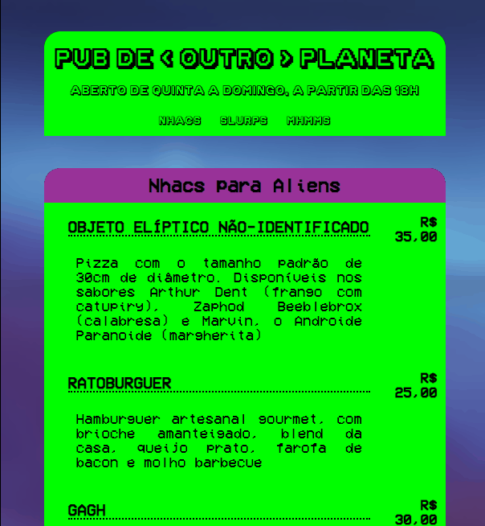

# Menu "Pub de < Outro > Planeta

### A primeira missão solo a gente nunca esquece 😜🐱‍🚀

Um menu genérico para um pub de tema ficção científica, onde todo o cardápio é igualmente temático. O objetivo para esse primeiro projeto pessoal independente foi **testar os conhecimento até aqui e me virar majoritariamente sozinha com quaisquer problemas que eu encontrasse.**

## Dificuldades 🤯

Por uma das metas ter sido *desenvolver todo o projeto de maneira rápida e eficaz, em menos de um dia*, em alguns momentos a principal dificuldade enfrentada foi a frustração de não saber como consertar um problema no código. Para lidar com isso, eu fiz uma pausa, removi minha cabeça do código e voltei alguns minutos depois, com um novo olhar e mais calma para lidar com a situação.

## Linguagens

HTML5 e CSS3 puro

## O Projeto em Funcionamento

